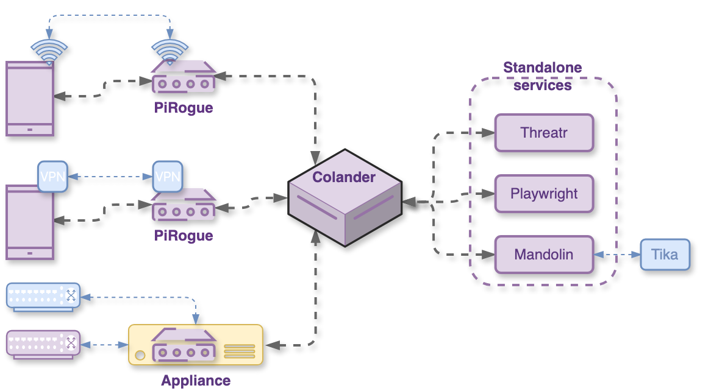
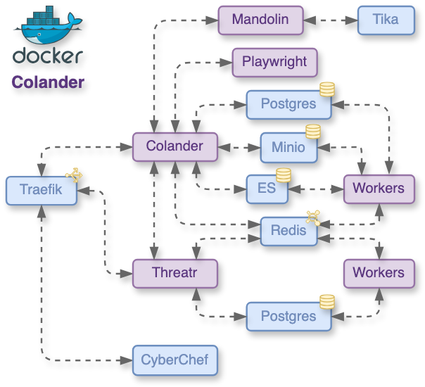

# Project overview
PiRogue Tool Suite (PTS) provides a platform combining analysis tools, knowledge management, incident response management and artifact management, which allows NGOs with limited resources to equip themselves at a low cost. The project consists of an open-source tool suite that provides a comprehensive mobile device forensics and digital investigation platform.

* Website: [pts-project.org](https://pts-project.org)
* Email: `hello [at] pts-project.org`
* GitHub: [Source code](https://github.com/PiRogueToolSuite) - [Roadmap](https://github.com/orgs/PiRogueToolSuite/projects/3/views/4)
* Get support: [Discord](https://discord.gg/qGX73GYNdp)
* Support us: [OpenCollective](https://opencollective.com/pts)

---

# 📢 Announcements
* The next community meeting will happen on Feb. 28 at 2pm CET. 
* The [analysis report](https://pts-project.org/blog/analysis-of-moi-jordanian-ministry-of-interior-v1.63/) of the app *MOI - Jordanian Ministry Of Interior* is now public.
* Fill in [the form](https://docs.google.com/forms/d/e/1FAIpQLScT-0cH8rwKMSEKO-WK-6ipoNKnhV5FdcIH-sGJXOE7et5eTg/viewform?usp=sf_link) to select the Android app for next month.
* To ensure we're meeting your needs and expectations, we kindly ask you to complete a [brief feedback form](https://forms.gle/Ajof3sfKGCeHEBSj8).

# 🎉 Impacts and results
The architecture of Colander is designed to be modular, relying on multiple reusable components and services we maintain. Instead of creating a monolithic service, the processing, and analysis of files and artifacts are delegated to a standalone service called [Mandolin](https://github.com/PiRogueToolSuite/mandolin). This modular architecture enables other projects to reuse the components we develop and maintain.

# 📒 Activity report
You can find more details about the different activities in the [project roadmap](https://github.com/orgs/PiRogueToolSuite/projects/3/views/4).

## 📦 US2 - Better knowledge management
A significant improvement involves refining knowledge organization and representation within Colander. This includes establishing a hierarchical structure for cases, where parent cases inherit from child cases, enhancing the management of extensive investigations. Furthermore, Colander will support the creation of multiple graphs within a single case, allowing for diverse projections of a subset of the case knowledge graph. The inclusion of thumbnails on graph nodes will simplify the investigation by involving pictures.

### Overview of the different activities
* 🔁 Create a hierarchy of cases
* 🔁 Create multiple graphs
* 🔁 Add thumbnails on graph nodes
* 🔁 Batch import of knowledge
* 🔁 Feature request: bulk add of observables

### Create multiple graphs
#### This month
We’ve introduced the concept of **subgraphs** in Colander, enabling users to create multiple graphs containing a subset of case entities. New views and pages have been added for managing subgraphs, simplifying their creation, editing, and deletion. The graph editor has been enhanced with sub-graphing capabilities, allowing users to selectively hide and show entities within the editor. These new features are organized in a new set of contextual menus, enhancing the user experience of the graph editor.

#### Next month
We will test the new features on the staging server and address any user experience issues as necessary.

## 📦 US5 - Offline artifact analysis
To bolster security measures and guarantee a sufficient level of confidentiality, Colander will allow the offline analysis of artifacts using antivirus software and user-defined Yara rules. In the context of forensic analysis, this is crucial to be able to locally analyze extracted files (without relying on 3rd-party services) to ensure case confidentiality.

### Overview of the different activities
* 🔁 Offline artifact AV analysis
* 🔁 Offline artifact analysis with user-defined Yara rules

### Offline artifact analysis with user-defined Yara rules
#### This month
The architecture of Colander is designed to be modular, relying on multiple reusable components and services. Instead of creating a monolithic service, the processing, and analysis of files and artifacts will be implemented as a standalone service called [*Mandolin*](https://github.com/PiRogueToolSuite/mandolin). Similar to [Threatr](https://github.com/PiRogueToolSuite/threatr), this service can be deployed alongside Colander or separately. This approach simplifies maintenance, enhances isolation and sandboxing, and enables other projects to integrate it without Colander.

Mandolin is currently undergoing active development, but its source code is already available on [GitHub](https://github.com/PiRogueToolSuite/mandolin). By now, it only supports a limited set of operations on files:

* the extraction of metadata and text from over a thousand different file types with [Apache Tika](https://tika.apache.org/)
* the binary analysis of files with [Yara](https://yara.readthedocs.io/en/latest/) rules

Those operations are exposed through a REST API and its corresponding Python client is already available on [PyPi](https://pypi.org/project/mandolin-python-client/) and [GitHub](https://github.com/PiRogueToolSuite/mandolin). The [specification of the API](https://pts-project.org/mandolin/) uses the [OpenApi standard](https://www.openapis.org/), this allows the automatic generation of clients in JavaScript, Go and many other programming languages.

#### Next month
No activity is planned for next month, as its released is scheduled for early 2026.

## 📦 US8 - Colander deployment and administration
In an effort to ease the deployment and administration of Colander servers, functionalities such as importing and exporting entire cases, one-click deployment, and backup and restore tooling and procedures will be implemented, to enhance the overall manageability of the system. We would like to make it easier for end-users to deploy Colander since the [deployment procedure described on GitHub](https://github.com/PiRogueToolSuite/colander?tab=readme-ov-file#production-environment) can be tricky to follow if one does not have the technical expertise to do so.

### Overview of the different activities
* 🔁 1-click deployment
* 🔁 Backup and restore tools

### 1-click deployment
#### This month
We have reworked the [configuration of the service stack](https://github.com/PiRogueToolSuite/colander-ansible/blob/main/roles/colander/templates/no-sso.yml.j2) in order to address initial limitations. The logs of the Docker containers are now redirected to [`journald`](https://www.freedesktop.org/software/systemd/man/latest/systemd-journald.service.html) which is the standard logging service on Debian-based distributions. This allows seamless integration with external tools. As an example, [`fail2ban`](https://github.com/fail2ban/fail2ban) can be configured to ingest the logs of Colander and automatically block or ban IP addresses after *x* authentication failures. 

The logs are tagged in a way that it's easy for the administrator to filter or extract logs for a specific container, service, or type of service. As an example, the command `journalctl -f CONTAINER_NAME=colander-colander-front-1` prints the logs of the container `colander-colander-front-1`.

#### Next month
We will release the first stable version of the _Ansible_ playbooks.

### Backup and restore tools
#### This month
We have initiated the implementation of [the tool to back up and restore](https://github.com/PiRogueToolSuite/colander-ansible) a Colander server. Except for Minio (S3-compatible block storage), all other services already come with all the necessary tools to back up and restore them. The installation playbook for Colander deploys a simple `bash` script that triggers the backup of the Postgres databases and the Elasticsearch indexes.

The configuration of the whole service stack is stored in a single encrypted file (a vault) that can be backed up too. Since all the Docker containers are stateless, the migration of Colander from one server to another will be as simple as moving files from one place to another.

#### Next month
We will continue the implementation of the backup and restore tool. 

## 📦 US101 - Maintenance
We manufacture PiRogues to supply organizations, while taking care of its maintenance. We will include OS upgrades, improvement of the documentation and fixing bugs. Regarding Colander and Threatr, we maintain the public Colander server, upgrade dependencies, improve the documentation and fix bugs.

#### This month
A new visual concept has been introduced to improve the readability of sidebar menus when users navigate through submenus and categories. This rework introduces the **pin to sidebar** principle, allowing users to pin and unpin subgraphs. If user feedback is positive, it will be generalized to other types of entities and menus.

The graph editor has been improved in terms of user experience. The focused entity from the entity list sidepane is now highlighted and better centered in the current visible viewport.

#### Next month
Following the *Interoperability* roadmap, the Vue3 *HAR analyzer* will be integrated into Colander. Additionally, Vue2 components will be migrated and re-packaged for Vue3.

## 📦 US102 - Community and outreach
Given the success of events, webinars and demos with members of the civil society, NGOs and security researchers, we continue with our outreach plan. We organize trainings and demonstration sessions as well as creating spaces for the community to share feedback and request new features via our mailing list, GitHub issues or Discord server.
We analyze one Android app that has received the community's interest (ex COP28 app) per month. The application to be analyzed is chosen by the community. The analysis report is first privately shared with the community and one month later it is publicly released.

We organize monthly calls open to all members of the community to share project updates and get the community’s feedback.

#### This month
We have publicly released the [analysis report](https://pts-project.org/blog/analysis-of-moi-jordanian-ministry-of-interior-v1.63/) of the *MOI - Jordanian Ministry Of Interior* Android application.

The PTS community meeting took place on Jan. 31. This was a good opportunity to present the latest improvements of PTS. The next one will happen on Feb. 28 at 2pm CET.

#### Next month
We will continue with our recurring activities.

## 📦 US103 - Governance
#### This month
We’ve applied to the Open Technology Fund’s [user experience discovery lab](https://www.opentech.fund/labs/uxd-lab/) to assist us with user research, system mapping, audience mapping, and designing sustainable user feedback flows. This support is crucial for the PTS project because it will directly address the usability and accessibility challenges our users encounter. By providing data-driven insights, we can prioritize features, enhance workflows, and design a more intuitive and effective tool.

We’ve followed up with potential partners to explore different hosting options for our users. 

#### Next month
We will continue with our recurring activities.

